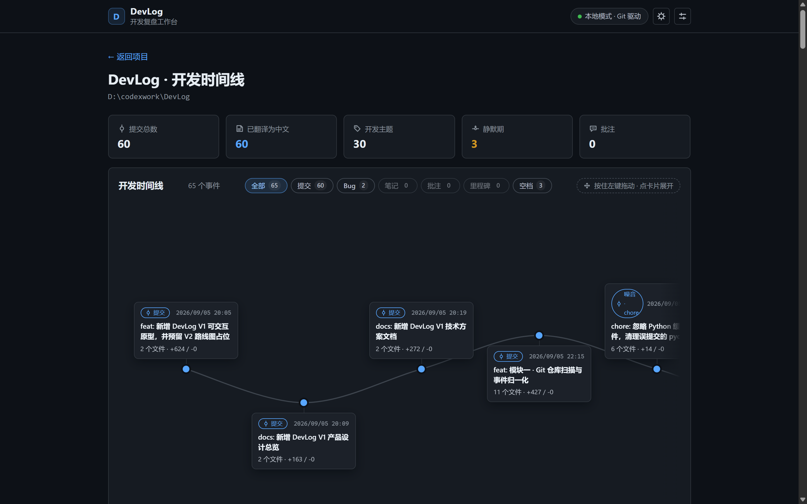
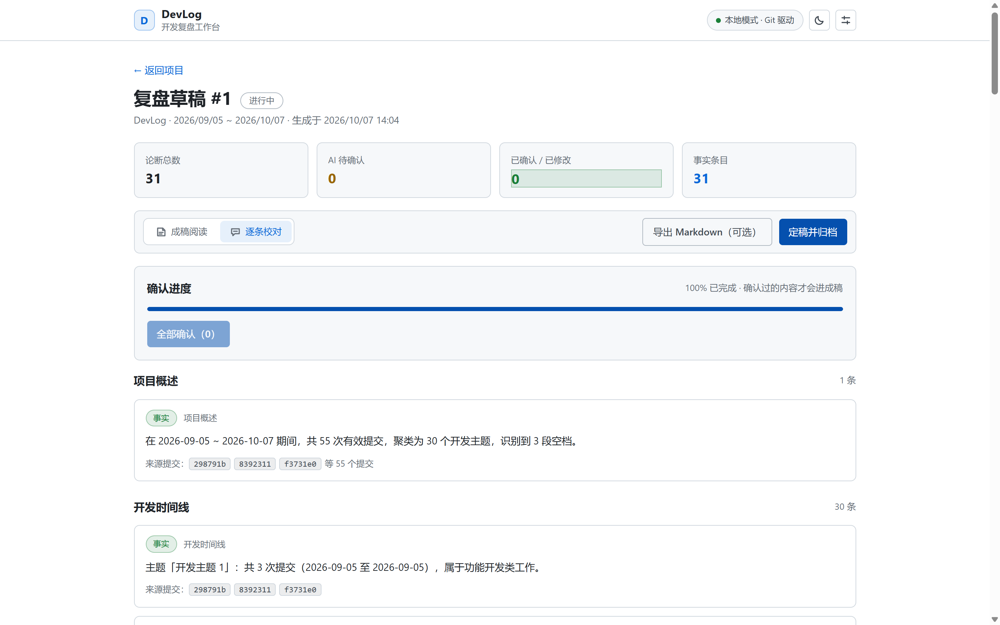
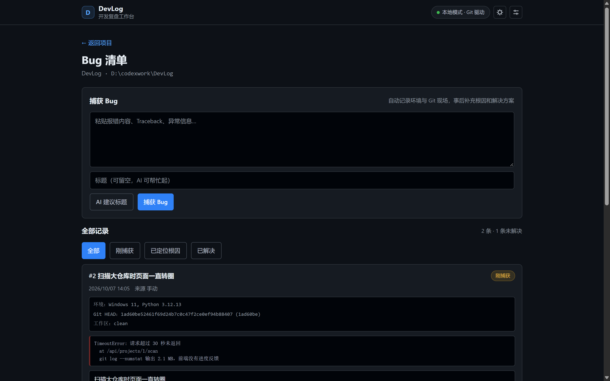
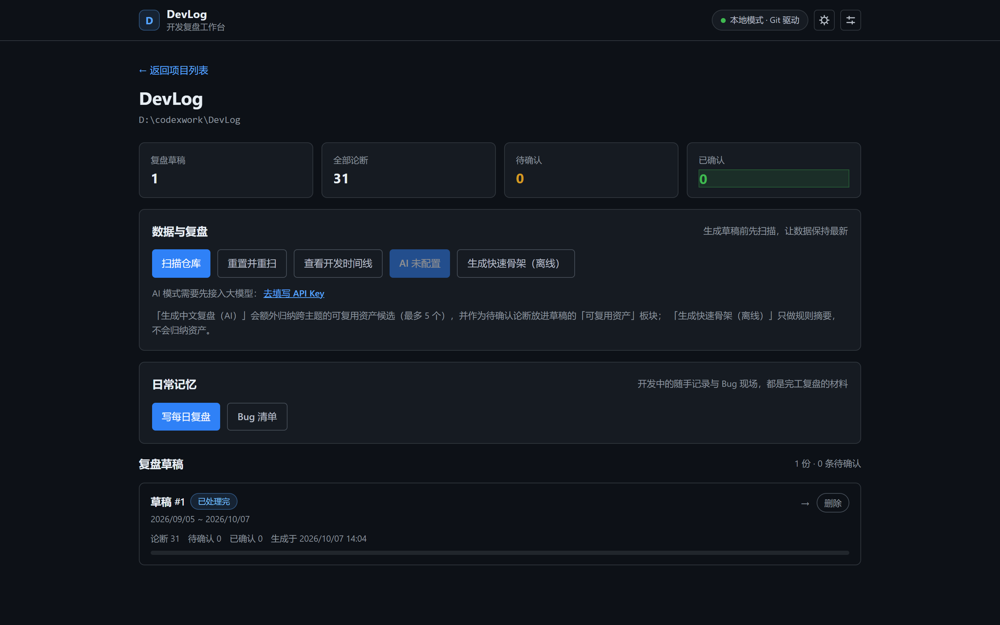

# DevLog

[](https://github.com/young-ty/devlog/actions/workflows/tests.yml)

DevLog 是面向个人开发者的**本地开发复盘工具**：扫描 Git 仓库的提交历史，
按开发主题聚类，再生成一份“有据可查、人机共创”的结构化复盘草稿。
事实论断带 commit 来源，AI 推断先标记为“待确认”，你确认并补充后导出 Markdown。

## 界面预览

<table>
<tr>
<td width="50%"><br>
<sub>开发时间线：提交、Bug、笔记、静默期挂在同一条曲线上，可拖动浏览</sub></td>
<td width="50%"><br>
<sub>复盘草稿：每条事实都带 commit 来源，逐条确认后才进成稿</sub></td>
</tr>
<tr>
<td width="50%"><br>
<sub>Bug 现场：一键存下报错、环境与 Git 状态，事后补根因和解法</sub></td>
<td width="50%"><br>
<sub>项目工作台：扫描仓库、生成草稿、进入时间线与日常记录</sub></td>
</tr>
</table>

> 截图取自本仓库自身的开发历史；时间线里的中文提交说明是 AI 翻译缓存，原始
> commit subject 始终是事实来源。

## 快速体验（不装任何环境）

到 [Releases](https://github.com/young-ty/devlog/releases/latest) 下载 `DevLog.exe`，双击运行，
浏览器会自动打开 <http://127.0.0.1:8000>。目标机器不需要装 Python，也不需要装 Node。

> 发布包没有做代码签名，Windows 首次运行会弹 SmartScreen 提示，点「更多信息 → 仍要运行」即可；
> Release 页里附了 SHA256 校验值。关掉那个黑色控制台窗口就等于退出 DevLog。
> 所有状态都只留在本机 `%USERPROFILE%\.devlog\`，不会上传到任何地方。

想从源码运行或参与开发，看下面的[快速开始](#快速开始)。

## 核心能力

- 只读 Git 历史，零侵入：不需要在开发过程中额外记录任何东西；
- 自动聚类开发主题，识别噪音提交（merge / wip / chore 等）与静默期；
- 项目时间线：按主题分组浏览全部提交，标出里程碑候选与静默期；
- 每日复盘：写之前先看「当天都发生了什么」——当天提交、当天捕获的 Bug、
  统计数字，一键把提交排成草稿，不用凭记忆硬凑；
- Bug 现场捕获：一键存下报错、环境与 Git 状态（HEAD + 工作区），事后补根因与解法；
- AI 摘要逐条附 commit 来源，降低幻觉风险；
- 复盘草稿区分“事实”与“AI 待确认”，支持逐条确认/补充后导出；
- 复盘成稿：只有确认过的内容才进正文，界面里读、可定稿归档、也可以导出 Markdown；
- 深色 / 浅色双主题，一键切换并记住选择；
- 大模型接入就在网页里：顶栏齿轮 → 填 API Key → 测试连接 → 保存，不用手改配置文件；
- 内置离线评测集，用人工 golden set 量化摘要质量。

## 技术栈

- Python 3.12 + FastAPI + Uvicorn
- SQLite（本地状态库，`~/.devlog/devlog.db`）
- React + TypeScript + Vite（本地 Web 界面）
- DeepSeek API（通过 provider 抽象层，可替换）

## 快速开始

### 1. 安装

```powershell
python -m venv .venv
.\.venv\Scripts\Activate.ps1
pip install -e .
```

安装后终端里会多出 `devlog` 命令：

```powershell
devlog --version
```

### 2. 命令行全流程演示（对本仓库 dogfood）

```powershell
devlog init .
devlog scan .
devlog review generate --offline
devlog review list
devlog review answer 1 1 --text "选 SQLite 是因为要做到零依赖部署"
devlog review confirm 1 --all
devlog review export 1
```

`--offline` 不调用 AI、不需要 API key，适合无网演示和自动化测试。
去掉 `--offline` 才会走 DeepSeek 生成真正的 AI 摘要。

### 3. 启动本地 Web 界面

#### 日常使用：一键启动

双击项目根目录的 `start-devlog.bat`（或在终端执行 `.\start-devlog.bat`）。
脚本会自动构建前端（首次需要）、启动服务并打开 <http://127.0.0.1:8000>。
**关掉那个黑窗口就等于停止 DevLog。**

它做的事只有三步：补齐前端产物 → 调用 `devlog serve --open` → 打开浏览器。
命令行等价写法：

```powershell
devlog serve --open
```

后端会直接托管 `devlog/web/dist` 里的构建产物，所以页面和 API 共用
127.0.0.1:8000 这一个端口，不需要再单独开着前端服务器。

#### 开发调试：前后端两个终端

改前端代码时需要热更新，这时按传统方式开两个终端。

终端一：启动后端 API（默认只监听本机 127.0.0.1:8000）

```powershell
devlog serve
```

终端二：启动前端开发服务器

```powershell
cd devlog/web
pnpm install
pnpm dev
```

浏览器打开 <http://localhost:5173>。

此时前端开发服务器会把 `/api` 请求代理到 127.0.0.1:8000 的后端。

### 4. 配置 DeepSeek（可选）

打开网页后点顶栏的齿轮图标，在「大模型设置」里填 API Key，点「测试连接」
确认能通，再点「保存」即可。密钥只写进本机的 `%USERPROFILE%\.devlog\config.toml`，
不进数据库、也不会进入任何 Git 仓库；界面上只回显 `sk-1****abcd` 这样的掩码。

习惯手改配置的话，直接创建 `%USERPROFILE%\.devlog\config.toml` 也一样有效：

```toml
api_key = "sk-你的密钥"
model = "deepseek-v4-flash"
```

也可以设置环境变量 `DEEPSEEK_API_KEY`（优先级最高）。

### 5. 打包成 exe（可选）

想让 DevLog 变成"拷给别人双击就能用"的程序，双击 `build-app.bat`。
它会构建前端、调用 PyInstaller，产物是单文件 `dist\DevLog.exe`（约 20MB）：

```powershell
.\build-app.bat
dist\DevLog.exe doctor          # 自检：前端产物 / Git / 数据库 / 大模型
dist\DevLog.exe serve --open    # 等价于双击 exe
```

这个 exe 自带 Python 运行时和前端产物，**目标机器不需要装 Python，也不需要装 Node**。
双击它（不带任何参数）等于 `serve --open`：起服务 + 打开浏览器。

几个设计点：

- 前端产物按 `devlog/web/dist` 打进包里，运行时代码用同一个相对路径就能找到，
  不需要写 `if frozen` 分支；
- `uvicorn` 用 importlib 动态加载 loop/protocol 实现，静态分析看不到，
  所以 spec 里显式 `collect_submodules("uvicorn")`；
- exe 保留控制台窗口：日志看得见，关掉窗口就等于停服务。

## 测试与质量

```powershell
python -m unittest discover -s tests
python tests/test_product_design.py
python tests/test_technical_design.py
python -m devlog.eval
```

完整测试套件覆盖 Git 扫描、SQLite 存储、主题聚类、LLM、复盘生成/导出、
每日小结、CLI、FastAPI、React 构建以及离线评测，共 347 个用例，全量跑完约 40 秒。
每次 push 和 PR 都会在 GitHub Actions 上重跑一遍全量测试，并单独做一次前端类型
检查与构建，配置见 [.github/workflows/tests.yml](.github/workflows/tests.yml)。

## 项目结构

```text
devlog/
├── core/
│   ├── git_source/   # Git 扫描与事件建模
│   ├── storage/      # SQLite 状态库
│   ├── theming/      # 主题聚类
│   ├── llm/          # LLM provider 抽象与摘要
│   ├── review/       # 复盘草稿组装、成稿规则与 Markdown 导出
│   ├── capture/      # Bug 现场捕获与每日笔记的数据模型
│   ├── timeline/     # 把提交、Bug、笔记合并成一条时间线
│   └── digest/       # 当日小结：某一天的事实汇总
├── cli/              # devlog 命令行
├── server/           # FastAPI 本地 API
├── eval/             # golden set 离线评测
└── web/              # React + Vite 前端（项目 / 时间线 / 复盘 / 每日复盘 / Bug）
```

## 日常使用流程

1. 双击 `start-devlog.bat`，浏览器自动打开 <http://127.0.0.1:8000>；
2. 在「项目」页点 **浏览…**，用系统弹出的文件夹选择框挑一个 Git 仓库
   （不用手动复制路径；选完还会自动用文件夹名填好项目名）；
3. 点「注册项目」，进去后先「扫描」再「生成草稿」；
4. 打开一份草稿，逐条确认 AI 论断，并在文末的引导问题里写补充 ——
   回答会保存下来，导出时自动落进对应的板块（决策 / 踩坑 / 下一步）。
   引导问题只有三条，都是 Git 里查不到、只有你本人知道的东西；
   Bug 相关的内容直接来自 Bug 捕获记录，不用重复回答。
5. **开发当天**顺手点「写每日复盘」：页面顶部会列出当天的提交和捕获的 Bug，
   点「用提交记录起草」把事实排成草稿，再改成你自己的话；当天捕获的 Bug
   点一下就能跳到 Bug 页补根因，补完回来看小结即可。
6. 只有改前端代码时才需要 `pnpm dev`，日常使用不碰它。

「浏览…」只在**请求来自本机**时可用：对话框会在运行 DevLog 的那台电脑上弹出，
所以后端会先确认请求来自 127.0.0.1 / ::1 再弹窗。如果你用
`devlog serve --host 0.0.0.0` 把服务暴露到局域网，其他机器点「浏览…」会收到
403 提示，手动填写路径仍然可用。

选到一个没有 `.git` 的普通文件夹时，页面会立刻提示「这不是 Git 仓库」，
不会等到注册失败才告诉你。

## 常见问题

- 端口被占用：换端口启动，例如 `devlog serve --port 9000`；
- 提示缺少 API key：点界面顶栏的齿轮图标填写，或按上文手改 `~/.devlog/config.toml`，
  也可以先使用 `--offline` 生成离线草稿；
- 看久了觉得刺眼 / 想要浅色：点顶栏的太阳/月亮图标切换主题，选择会被记住；
- rebase / force push 之后历史变化：执行 `devlog scan . --reset` 重建缓存。
- 界面打不开 / 双击没反应：先跑 `devlog doctor`（打包版是 `dist\DevLog.exe doctor`），
  它会逐条告诉你前端产物、Git、数据库、大模型配置哪一项没就绪。
- 下载的 exe 被 Windows 拦下来：那是未签名程序的 SmartScreen 提示，点「更多信息 → 仍要运行」
  即可；想确认文件没被改过，把它的 SHA256 和 Release 页里公布的对比一下。
- 数据存在哪、怎么彻底清理：状态库和密钥都在 `%USERPROFILE%\.devlog\`
  （`devlog.db` 与 `config.toml`），删掉这个目录就等于回到全新状态。
  唯一会写进你自己仓库的，是你主动导出的复盘 Markdown（默认落在 `<仓库>/docs/retrospectives/`）。
